# Trabalho 1

## Sumário

1. [Informações gerais](#informações-gerais)
1. [Descrição](#descrição)
1. [Resposta em malha aberta](#resposta-em-malha-aberta)
1. [Método $K_u$](#método)
1. [Método do relé](#método-do-relé)
1. [Conclusão](#conclusão)
1. [Anexos](./assets)
    1. [Tabela de Ziegler-Nichols](./assets/pdf/ziegler_nichols.pdf)
    1. [Modelo 1]
    1. [Modelo 2]
    1. [Modelo 3]
    1. [Modelo 4]
    1. [Modelo 5]

## Informações gerais

- Disciplina: Laboratório de Controle Automático 2
- Professor: [Fernando Passold](mailto:fpassold@upf.br)
- Aluno: [Homero Kemmerich](mailto:146676@upf.br)
- Repositório: [github.com/HomeroKemmerich/pid-syntonization.git](https://github.com/HomeroKemmerich/pid-syntonization.git)

## Descrição

1. Aplicar o método 1 para sintonia de um PID para a seguinte planta:

   $G_1(s) = \frac{5}{2}\frac{1}{s^2 + 5,5s + 2,5}$ 

    Suponha que o sistema sintonizado com PID deva tentar respeitar: $OS < 20\%$ e $t_s < 0,67$ segundos (para entrada degrau unitário).

    Não é necessário realizar sintonia fina deste PID.

2. Aplicar os últimos 2 métodos de sintonia de um PID à seguinte planta:

    $G_{2 \ 3}(s) = \frac{21}{(s+1)(s+3)(s+7)}$

    Suponha que se deseja um $OS < 20%$ e um tempo de assentamento abaixo de $2,5$ segundos (para entrada degrau unitário).

    **Esperada sintonia fina** do PID inicialmente obtido.

## Resposta em malha aberta

Considerando a planta:

$G_1(s) = \frac{5}{2}\frac{1}{s^2 + 5,5s + 2,5}$

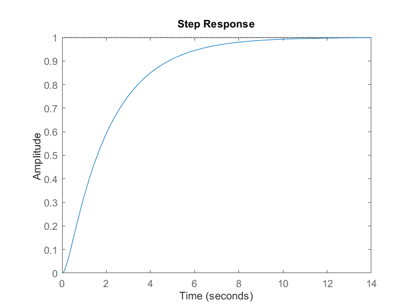

Primeiro transformamos a resposta em um vetor para poder utilizar a ferramente "Basic Fitting"

```matlab
>> G_1 = tf(5/2, [1 5.5 2.5]);
>> t =  0:0.1:14;
>> [y, t] = step(G_1);
```

1. Utilizando a ferramenta Basic Fitting, propõe-se o seguinte polinômio de 8ª ordem, cuja curva sobrepõe a curva do controlador:

    $y = 1.7917 \cdot 10^{-7} x^8 - 9.7264 \cdot 10^{-6} x^7 + 0.00021777 x^6 - 0.0025811 x^5 + 0.017097 x^4 - 0.058352 x^3 + 0.04594 x^2 + 0.34988 x - 0.029187$

    .png)

2. Obtemos os valores mínimos e máximos da curva derivando-a duas vezes

    ```matlab
    >> p = fit.coeff;       % coeficientes do polinômio
    >> dp = polyder(p);     % derivada 1a
    >> ddp = polyder(dp);   % derivada 2a
    ```

3. Obtemos, então, as raízes da derivada segunda para encontrarmos o ponto de inflexão

    ```matlab
    >> roots(ddp)

        ans =

            11.7217 + 0.0000i
            9.7806 + 0.0000i
            8.8513 + 0.0000i
            5.0220 + 1.8093i
            5.0220 - 1.8093i
            0.3167 + 0.0000i %!
    ```

    considerando $y = a \cdot t + b$

    ```matlab
    >> x = ans(6);
    >> a = polyval(dp, x);
    >> b = polyval(p, x) - a * x;
    ```

4. Com isso, obtemos a reta tangente ao ponto de inflexão de $G_1$

    

    Considerando:

    $y = a \cdot t + b; \
        0 = a \cdot t + b \
        \therefore \
        t = -\frac{b}{a}$

    e

    $y = a \cdot t + b; \
        10 = a \cdot t_1 + b \
        \therefore \
        t_1 = \frac{(10-b)}{a}$

    ```matlab
    >> L = -b/a;
    >> t_1 = (10 - b) / a;
    >> T = t_1 - L;
    ```

5. Agora, aplicamos os termos $L$ e $T$ na equação do PID:

    $C(s) = \frac{0,6T(s+\frac{1}{L})^2}{s}$

    ```matlab
    >> s = tf('s');
    >> C_PI = 0.6 * T * (s + 1/L)^2 / s;
    ```

    $C_{PI}(s)=\frac{16,508(s+11,89)^2}{s}$

6. Por fim fechamos a malha do controlador, obtendo uma resposta com *overshoot* próximo de $20\%$ e tempo de assentamento menor que $0,65s$.

    ```matlab
    >> oloop_C_PI = C_PI * G_1;
    >> cloop_C_PI = feedback(oloop_C_PI, 1);
    ```

    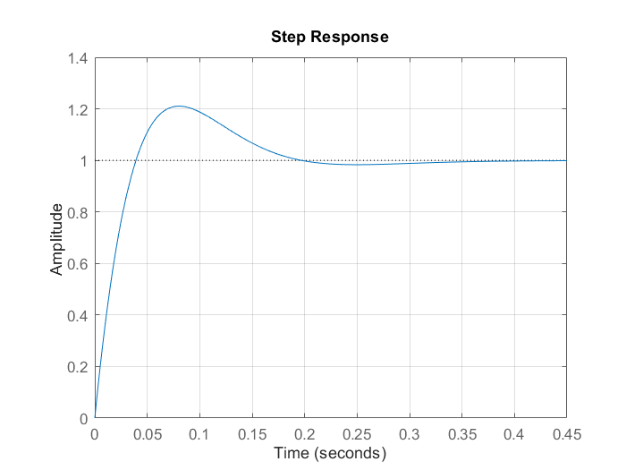

    ```matlab
            RiseTime: 0.0299
        TransientTime: 0.1776
        SettlingTime: 0.1776 %!
        SettlingMin: 0.9298
        SettlingMax: 1.2104
            Overshoot: 21.0444 %!
        Undershoot: 0
                Peak: 1.2104
            PeakTime: 0.0807
    ```

## Método $K_u$

Considerando a planta:

$\frac{21}{(s+1)(s+3)(s+7)}$

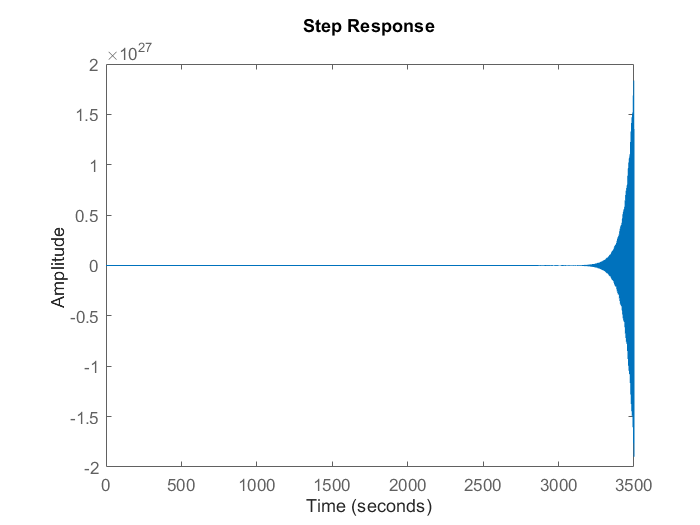

1. Encontramos seu ganho máximo através de seus polos, utilizanod o lugar geométrico das raízes.

    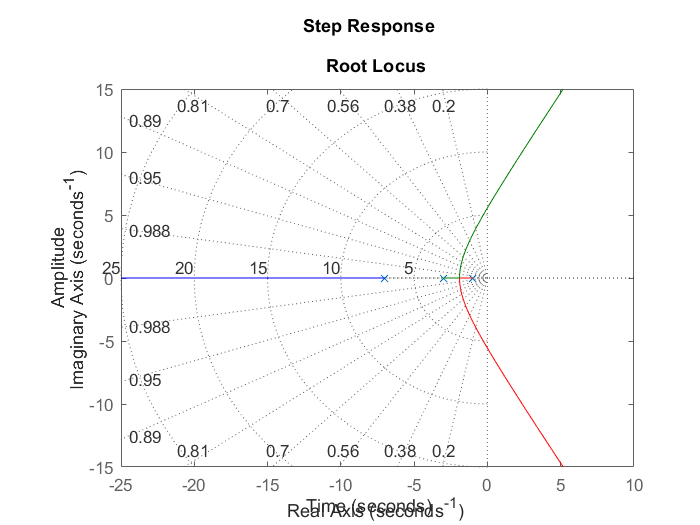

    a. Vamos assumir o ganho máximo como um valor entre $14.1\ dB$ e $16.9\ dB$

    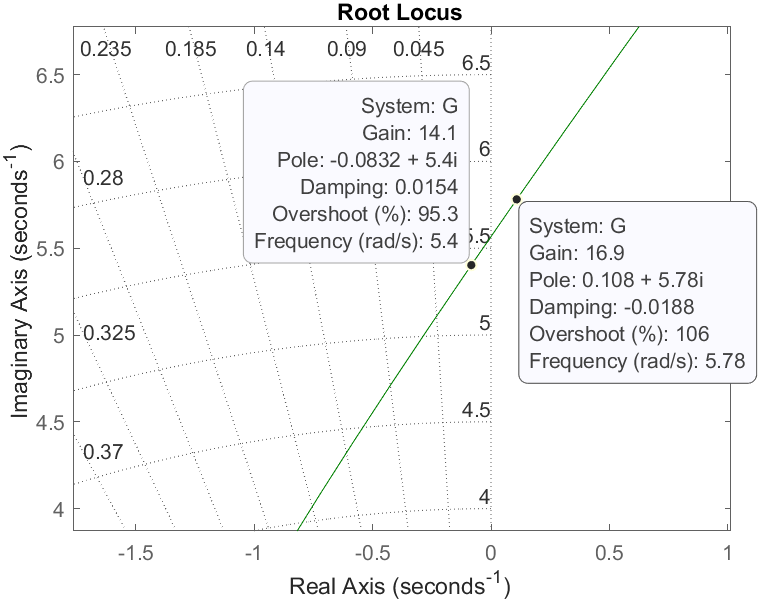

    ```matlab
    >> K_u = 15.5; %(16.9 - 14.1)/2
    ```

2. Com isso, fechamos a malha aplicando o ganho máximo, de acordo com o [Modelo 1]. A resposta desse modelo será um sistema em oscilação constante.

    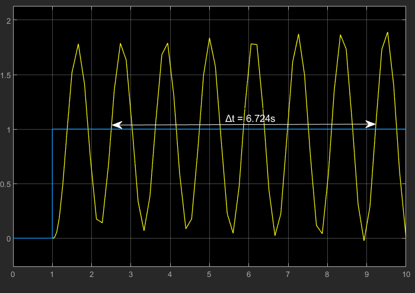

3. Com base na oscilação, calculamos o período dessa oscilação para que possamos utilizar a [Tabela de Ziegler-Nichols].

    ```matlab
    >> delta_t = 6.724;
    >> cicle_count = 6;
    >> T_u = delta_t / cicle_count;
    ```

4. Aplicando os valores de PID para encontrarmos o os ganhos proporcional, integrativo e derivativo, temos:

    ```matlab
    >> K_p = 0.6 * K_u;             % 09.3000 dB
    >> K_i = 1.2 * (K_u/T_u);       % 16.5973 db
    >> K_d = 0.075 * (K_u * T_u);   % 01.3028 dB
    ```

    a. Aplicando à planta do Simulink obtemos o [Modelo 2]:

    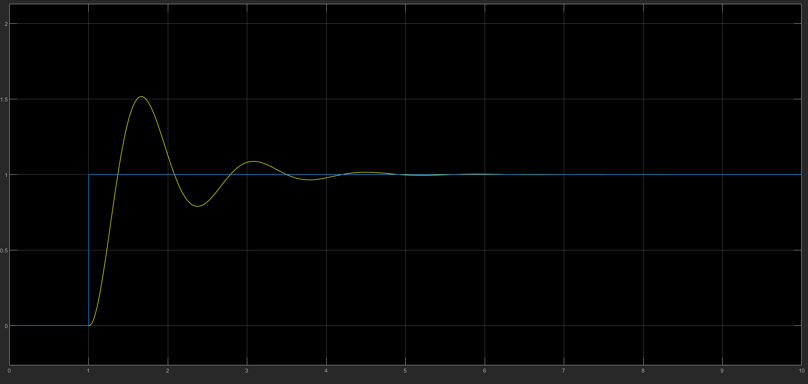

5. É possível observar um overshoot maior que 50, portanto vamos otimizar utlizando novamente a [tabela de Ziegler-Nichols]:

    ```matlab
    >> K_p = (1/3) * K_u;           % 05.1667 dB
    >> K_i = (2/3) * (K_u/T_u);     % 09.2207 dB
    >> K_d = (1/9) * (K_u*T_u);     % 01.9300 dB
    ```

    Assim, obtemos o [Modelo 3] como resposta final, com uma resposta otimizada:

    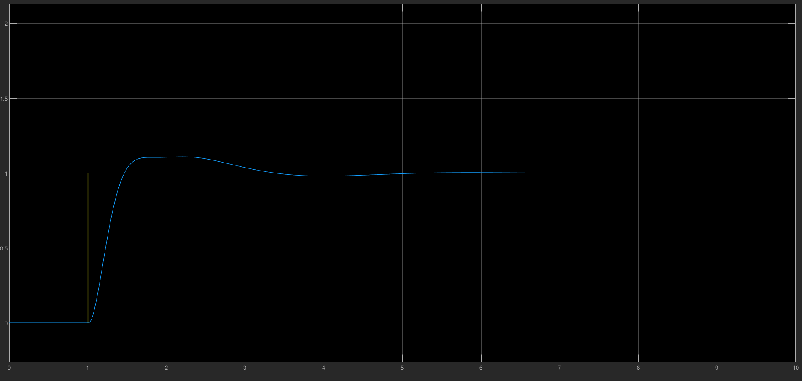

[Modelo 1]: ./assets/pdf/ku.pdf
[Modelo 2]: ./assets/pdf/pid_ku.pdf
[Modelo 3]: ./assets/pdf/optimised_pid.pdf

## Método do relé

Considerando a planta:

$G_1(s) = \frac{5}{2}\frac{1}{s^2 + 5,5s + 2,5}$


1. É criada uma planta de ajuste do relé, como é mostrado no [Modelo 4].

2. É calculado o ganho de baixa frequência da planta. esse ganho será utilizado na própria planta ([Modelo 4]);

    ```matlab
    >> T = dcgain(G);   % 1 dB
    ```

3. Obtém-se o período e a amplitude da resposta, para calcular os valores de $T_u$ e $a$.

    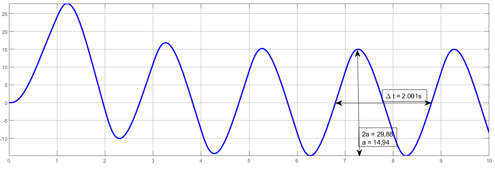

    ```matlab
    >> a = 14.94;
    >> T_u = 2.001;
    ```

4. Com base na saída do relé, calcula-se também a sua amplitude:

    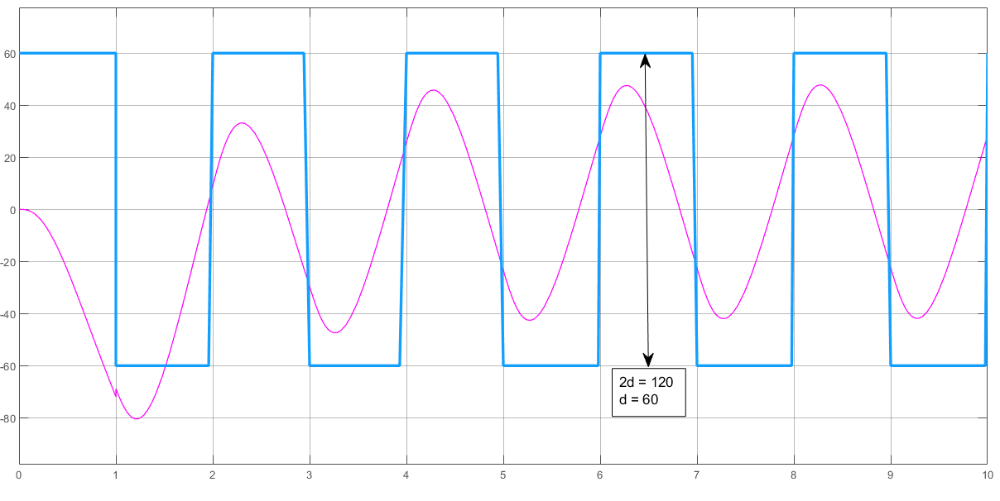

    ```matlab
    >> d = 60;
    ```

5. Com esses valores, encontra-se o ganho máximo do sistema ($K_u$)

    ```matlab
    >> K_u = (4 * d) / (pi * a);    % 5.1134 dB
    ```

6. Calcula-se os ganhos do PID a partir das informações obtidas. O exemplo pode ser ilustrado pelo [Modelo 5].

    ```matlab
    >> K_p = 0.6 * K_u;             % 3.0680 dB
    >> K_i = 1.2 * (K_u / T_u);     % 3.0665 dB
    >> K_d = 0.075 * (K_u * T_u);   % 0.7673 dB
    ```

    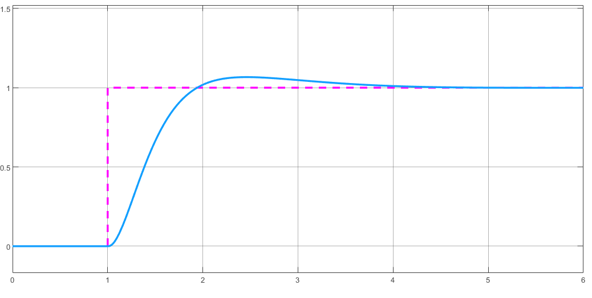

    O controlador não precisa ser otimizado pois já atende aos requisitos de tempo e *overshoot*

[Modelo 4]: ./assets/pdf/ajuste.pdf
[Modelo 5]: ./assets/pdf/pid.pdf
[tabela de Ziegler-Nichols]: ./assets/ziegler_nichols.md

## Conclusão

É possível observar que, para as plantas apresentadas e de acordo com o método utilizado para cada uma delas, a que mais se adequa é a segunda planta com o método do relé, pois apresenta uma resposta que atende aos requisitos sem a necessidade de uma otimização.
