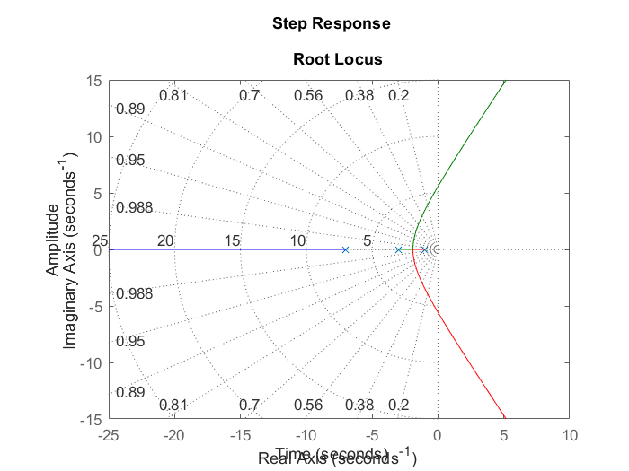
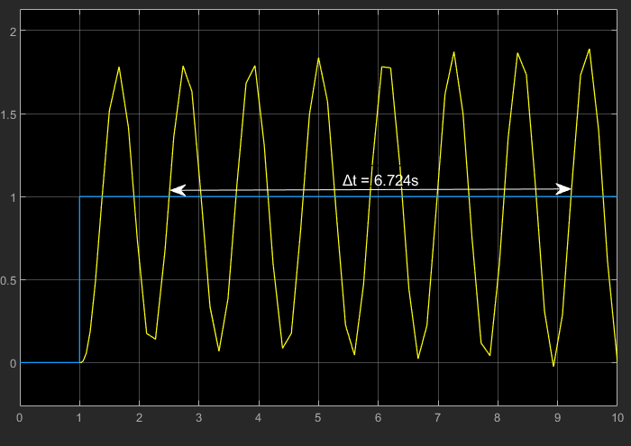
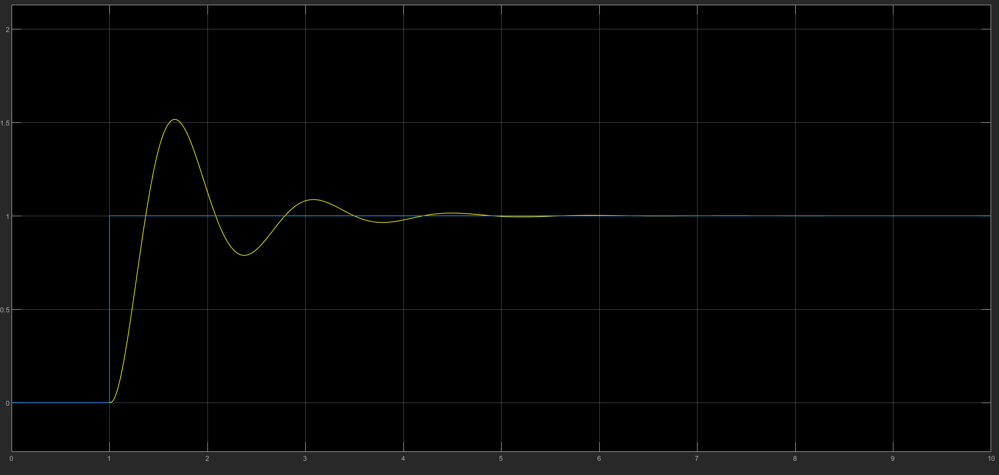
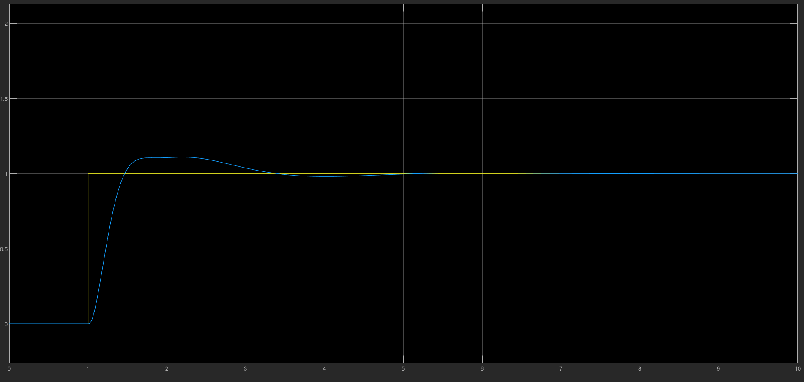

# Método $K_u$

Considerando a planta:

$\frac{21}{(s+1)(s+3)(s+7)}$


1. Encontramos seu ganho máximo através de seus polos, utilizanod o lugar geométrico das raízes.

    

    a. Vamos assumir o ganho máximo como um valor entre $14.1\ dB$ e $16.9\ dB$

    

    ```matlab
    >> K_u = 15.5; %(16.9 - 14.1)/2
    ```

2. Com isso, fechamos a malha aplicando o ganho máximo, de acordo com o [Modelo 1]. A resposta desse modelo será um sistema em oscilação constante.

    

3. Com base na oscilação, calculamos o período dessa oscilação para que possamos utilizar a [Tabela de Ziegler-Nichols].

    ```matlab
    >> delta_t = 6.724;
    >> cicle_count = 6;
    >> T_u = delta_t / cicle_count;
    ```

4. Aplicando os valores de PID para encontrarmos o os ganhos proporcional, integrativo e derivativo, temos:

    ```matlab
    >> K_p = 0.6 * K_u;             % 09.3000 dB
    >> K_i = 1.2 * (K_u/T_u);       % 16.5973 db
    >> K_d = 0.075 * (K_u * T_u);   % 01.3028 dB
    ```

    a. Aplicando à planta do Simulink obtemos o [Modelo 2]:

    

5. É possível observar um overshoot maior que 50, portanto vamos otimizar utlizando novamente a [tabela de Ziegler-Nichols]:

    ```matlab
    >> K_p = (1/3) * K_u;           % 05.1667 dB
    >> K_i = (2/3) * (K_u/T_u);     % 09.2207 dB
    >> K_d = (1/9) * (K_u*T_u);     % 01.9300 dB
    ```

Assim, obtemos o [Modelo 3] como resposta final, com uma resposta otimizada:



[Modelo 1]: ./assets/pdf/ku.pdf
[Modelo 2]: ./assets/pdf/pid.pdf
[Modelo 3]: ./assets/pdf/optimised_pid.pdf
[tabela de Ziegler-Nichols]: ../ziegler_nichols.md