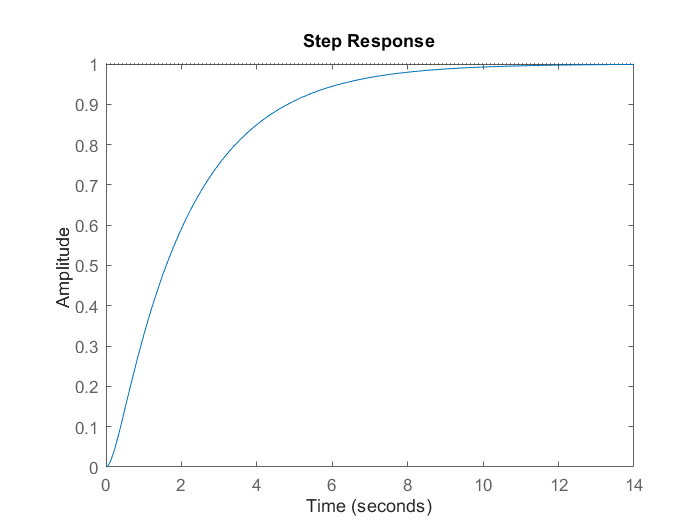
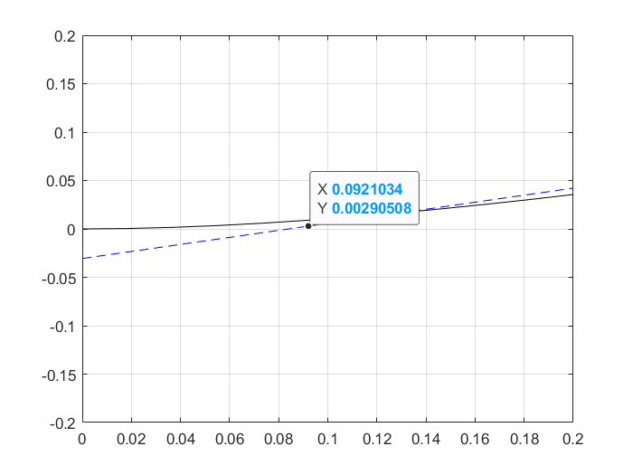
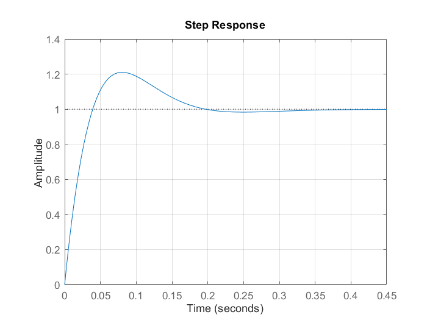

---
aliases:
    - oloop
    - Resposta em malha aberta
---

# Resposta em malha aberta

Considerando a planta:

$G_1(s) = \frac{5}{2}\frac{1}{s^2 + 5,5s + 2,5}$



Primeiro transformamos a resposta em um vetor para poder utilizar a ferramente "Basic Fitting"

```matlab
>> G_1 = tf(5/2, [1 5.5 2.5]);
>> t =  0:0.1:14;
>> [y, t] = step(G_1);
```

1. Utilizando a ferramenta Basic Fitting, propõe-se o seguinte polinômio de 8ª ordem, cuja curva sobrepõe a curva do controlador:

    $y = 1.7917 \cdot 10^{-7} x^8 - 9.7264 \cdot 10^{-6} x^7 + 0.00021777 x^6 - 0.0025811 x^5 + 0.017097 x^4 - 0.058352 x^3 + 0.04594 x^2 + 0.34988 x - 0.029187$

    .png)

2. Obtemos os valores mínimos e máximos da curva derivando-a duas vezes

    ```matlab
    >> p = fit.coeff;       % coeficientes do polinômio
    >> dp = polyder(p);     % derivada 1a
    >> ddp = polyder(dp);   % derivada 2a
    ```

3. Obtemos, então, as raízes da derivada segunda para encontrarmos o ponto de inflexão

    ```matlab
    >> roots(ddp)

        ans =

            11.7217 + 0.0000i
            9.7806 + 0.0000i
            8.8513 + 0.0000i
            5.0220 + 1.8093i
            5.0220 - 1.8093i
            0.3167 + 0.0000i %!
    ```

    considerando $y = a \cdot t + b$

    ```matlab
    >> x = ans(6);
    >> a = polyval(dp, x);
    >> b = polyval(p, x) - a * x;
    ```

4. Com isso, obtemos a reta tangente ao ponto de inflexão de $G_1$

    

    Considerando:

    $y = a \cdot t + b; \
        0 = a \cdot t + b \
        \therefore \
        t = -\frac{b}{a}$

    e

    $y = a \cdot t + b; \
        10 = a \cdot t_1 + b \
        \therefore \
        t_1 = \frac{(10-b)}{a}$

    ```matlab
    >> L = -b/a;
    >> t_1 = (10 - b) / a;
    >> T = t_1 - L;
    ```

5. Agora, aplicamos os termos $L$ e $T$ na equação do PID:

    $C(s) = \frac{0,6T(s+\frac{1}{L})^2}{s}$

    ```matlab
    >> s = tf('s');
    >> C_PI = 0.6 * T * (s + 1/L)^2 / s;
    ```

    $C_{PI}(s)=\frac{16,508(s+11,89)^2}{s}$

6. Por fim fechamos a malha do controlador, obtendo uma resposta com *overshoot* próximo de $20\%$ e tempo de assentamento menor que $0,65s$.

```matlab
>> oloop_C_PI = C_PI * G_1;
>> cloop_C_PI = feedback(oloop_C_PI, 1);
```



```matlab
         RiseTime: 0.0299
    TransientTime: 0.1776
     SettlingTime: 0.1776 %!
      SettlingMin: 0.9298
      SettlingMax: 1.2104
        Overshoot: 21.0444 %!
       Undershoot: 0
             Peak: 1.2104
         PeakTime: 0.0807
```
