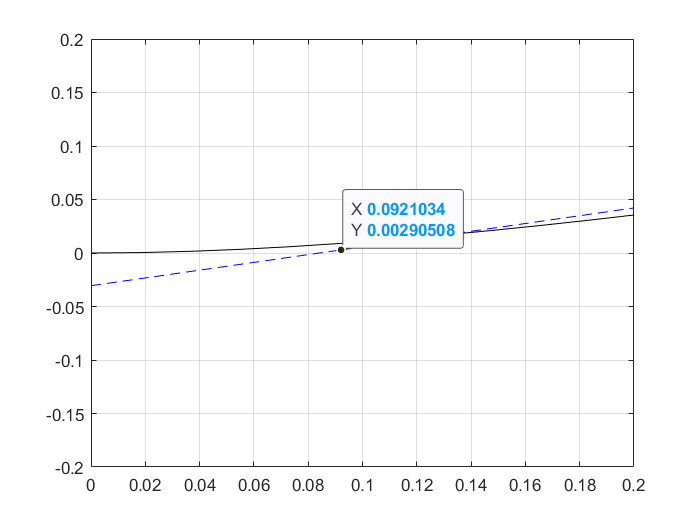

# Resposta em malha aberta

Considerando a planta:

   $G_1(s) = \frac{5}{2}\frac{1}{s^2 + 5,5s + 2,5}$ 

Utilizando a ferramenta Basic Fitting, propõe-se o seguinte polinômio de 8ª ordem, cuja curva sobrepõe a curva do controlador:

$
    y = 1.7917 \cdot 10^{-7} x^8 - 9.7264 \cdot 10^{-6} x^7 + 0.00021777 x^6 - 0.0025811 x^5 + 0.017097 x^4 - 0.058352 x^3 + 0.04594 x^2 + 0.34988 x - 0.029187
$

.png)

Obtemos os valores mínimos e máximos da curva derivando-a duas vezes

```matlab
>> p = fit.coeff;       % coeficientes do polinômio
>> dp = polyder(p);     % derivada 1a
>> ddp = polyder(dp);   % derivada 2a
```

Obtemos, então, as raízes da derivada segunda para encontrarmos o ponto de inflexão

```matlab
>> roots(ddp)

    ans =

        11.7217 + 0.0000i
        9.7806 + 0.0000i
        8.8513 + 0.0000i
        5.0220 + 1.8093i
        5.0220 - 1.8093i
        0.3167 + 0.0000i %!
```

considerando $y = a \cdot t + b$

```matlab
>> x = ans(6);
>> a = polyval(dp, x);
>> b = polyval(p, x) - a * x;
```

Com isso, obtemos a reta tangente ao ponto de inflexão de $G_1$



Considerando:

$
    y = a \cdot t + b; \
    0 = a \cdot t + b \
    \therefore \
    t = -\frac{b}{a}
$

e

$
    y = a \cdot t + b; \
    10 = a \cdot t_1 + b \
    \therefore \
    t_1 = \frac{(10-b)}{a}
$

