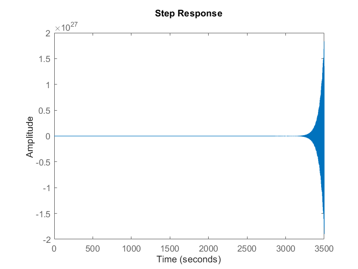
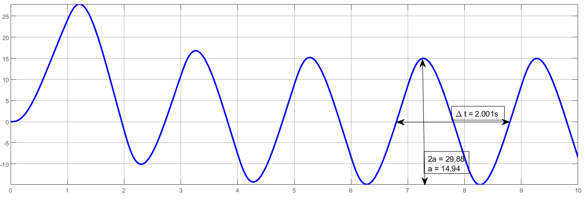
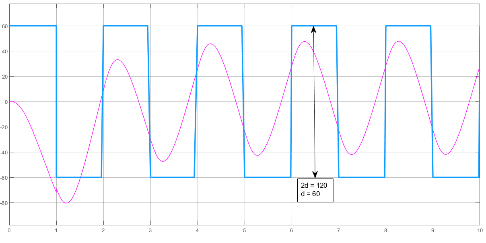
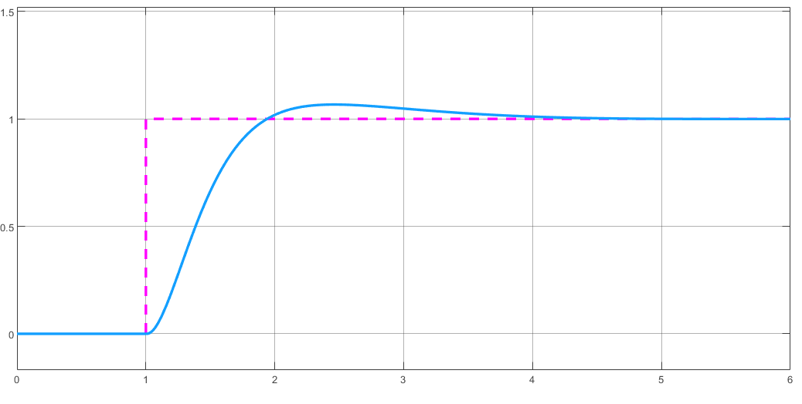

---
aliases:
    - Método do relé
tags:
    - controle-automatico/pid/sintonia
---

# Método do relé

Considerando a planta:

$G_1(s) = \frac{5}{2}\frac{1}{s^2 + 5,5s + 2,5}$



1. É criada uma planta de ajuste do relé, como é mostrado no [Modelo 1].

2. É calculado o ganho de baixa frequência da planta. esse ganho será utilizado na própria planta ([Modelo 1]);

    ```matlab
    >> T = dcgain(G);   % 1 dB
    ```

3. Obtém-se o período e a amplitude da resposta, para calcular os valores de $T_u$ e $a$.

    

    ```matlab
    >> a = 14.94;
    >> T_u = 2.001;
    ```

4. Com base na saída do relé, calcula-se também a sua amplitude:

    

    ```matlab
    >> d = 60;
    ```
    
5. Com esses valores, encontra-se o ganho máximo do sistema ($K_u$)

    ```matlab
    >> K_u = (4 * d) / (pi * a);
    ```

6. Calcula-se os ganhos do PID a partir das informações obtidas. O exemplo pode ser ilustrado pelo [Modelo 2].

    ```matlab
    >> K_p = 0.6 * K_u;
    >> K_i = 1.2 * (K_u / T_u);
    >> K_d = 0.075 * (K_u * T_u);
    ```

    

O controlador não precisa ser otimizado pois já atende aos requisitos de tempo e *overshoot*

[Modelo 1]: ./assets/pdf/ajuste.pdf
[Modelo 2]: ./assets/pdf/pid.pdf
[tabela de Ziegler-Nichols]: ../ziegler_nichols.md